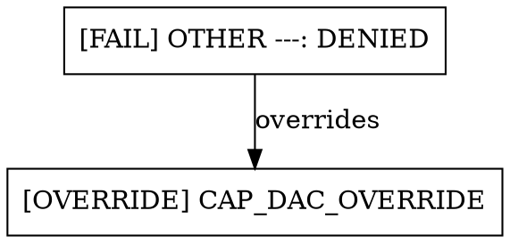

# Permission Hell

`permissionhell` is a read-only Linux effective-access debugger. It explains why
an account passes or fails each directory search check, which Unix permission
class or POSIX access-ACL entry applies to the target, how an ACL mask changes
effective permissions, and whether its mount adds a restriction.

**v1.1 adds terminal, JSON and DOT access graphs and models Unix DAC, POSIX access ACLs, mount restrictions, mapped process
identities across user namespaces, and two effective DAC capabilities in supported
process contexts, not every Linux access-control layer.** SELinux,
AppArmor, other capability effects, foreign mount/root path translation,
container orchestration, and NFS/SMB/CIFS/FUSE-specific behavior are not
modeled. A permitted result means this model permits the request; it is not a
guarantee that a real process can perform it. Reports identify the DAC + ACL + mount
model; `--verbose` and `--help` include the full scope and limitations.

## Installation

Requires **Linux and Python 3.10+**. There are no runtime dependencies or required
external utilities. Plain text output works without Rich.

Run directly from the checkout:

```bash
python3 permissionhell.py --help
python3 permissionhell.py diagnose /srv/music/song.flac --as navidrome
```

Optionally install a `permissionhell` command into a virtual environment:

```bash
python3 -m venv .venv
. .venv/bin/activate
python3 -m pip install .
permissionhell diagnose /srv/music/song.flac --as navidrome
```

Installation uses setuptools; direct script execution needs only Python's
standard library. Unsupported operating systems report a clear error, while
`--help` and `--version` remain available.

## Usage

```bash
python3 permissionhell.py diagnose TARGET_PATH --as USERNAME [--mode {r,w,x}] [--verbose]
python3 permissionhell.py audit TARGET_PATH [--mode {r,w,x}] [--verbose]
python3 permissionhell.py audit TARGET_PATH --explain USERNAME [--mode {r,w,x}] [--verbose]
python3 permissionhell.py process ABSOLUTE_TARGET --pid PID [--mode {r,w,x}] [--verbose] [--json]
python3 permissionhell.py audit-processes ABSOLUTE_TARGET [--pid PID ...] [--mode {r,w,x}] [--verbose] [--json]
python3 permissionhell.py graph TARGET --as USERNAME [--mode {r,w,x}] [--verbose] [--json | --dot]
python3 permissionhell.py graph ABSOLUTE_TARGET --pid PID [--mode {r,w,x}] [--verbose] [--json | --dot]

python3 permissionhell.py diagnose /srv/music/song.flac --as navidrome --mode r
python3 permissionhell.py diagnose /var/www/app.db --as www-data --mode w
python3 permissionhell.py diagnose /opt/scripts/backup.sh --as backup --mode x
python3 permissionhell.py diagnose /srv/music/song.flac --as navidrome --verbose
python3 permissionhell.py audit /srv/music/song.flac
python3 permissionhell.py audit /srv/customer-data/report.csv --mode w
python3 permissionhell.py audit /srv/customer-data/report.csv --verbose
```

`diagnose` asks whether **one named account** can access the path and explains
each step. `audit` asks **which local accounts** can access it, with compact
per-account explanations and permitted/denied/error totals. Both default to read.

Default output leads with the verdict and its reason, then shows compact PASS/FAIL
search checks, target metadata, and a single mount summary. `BLOCKED HERE` marks
the first failing inode. `--verbose` restores every search observation, detailed
per-inode reasoning, inspected ACL entries and masks, group memberships, all mount
options, and model limitations. Unrelated ACL entries are hidden in concise output.

The default mode is `r`. Read (`r`), write (`w`), and execute/search (`x`) each
request one permission on an **existing inode**. This is not a create, delete,
rename, shell execution, or database transaction simulation. A directory's `r`
bit concerns listing names, `w` concerns modifying entries, and `x` concerns
searching it. Creating an entry normally requires both `w` and `x`; a `--mode w`
check alone does not establish that a whole operation will succeed.

Relative paths start at the debugger's current working directory. Shell expansion
of `~` happens before invocation; the program does not expand a quoted `~`.

The account being evaluated is supplied by `--as` or `--explain`, regardless of who launches the
debugger. The program does not impersonate the account or call `os.access()`.
An unprivileged debugger may be unable to read necessary metadata. That produces
a diagnostic error, not a false denial attributed to the subject. Run from an
account that can inspect the path when necessary; even a privileged invocation
still evaluates the supplied subject.

## Visual access graphs (v1.1)

```bash
permissionhell graph /srv/private/secrets.db --as www-data --mode r
permissionhell graph /srv/private/secrets.db --pid 812 --mode r
permissionhell graph /srv/private/secrets.db --pid 812 --verbose
permissionhell graph /srv/private/secrets.db --pid 812 --json
permissionhell graph /srv/private/secrets.db --pid 812 --dot
```

Choose exactly one identity (`--as` or `--pid`) and at most one export format.
The default is a plain-text graph with ASCII arrows and explicit status labels;
it requires neither color nor a TTY. Account paths follow existing diagnose path
rules; process paths must be absolute in the debugger's root/mount namespace.
Exit codes and access decisions are inherited unchanged from the corresponding
single-account or single-process diagnosis.

**This is a representation of Permission Hell's access model, not kernel tracing.**
The builder consumes collected structured decisions; it neither re-evaluates
permissions nor scrapes human explanations. It performs no additional filesystem
inspection. A modeled PERMITTED result still does not guarantee syscall success.

For example, an ordinary owner check appears in the chain as:

```text
[NEUTRAL] UID 9000, primary GID 100
  |
  v
[NEUTRAL] '/data/file' (target)
  |
  v
[NEUTRAL] Owner UID 9000; GID 500; mode 0644
  |
  v
[PASS] UID matches owner -> OWNER rw-: PERMITTED
```

GROUP selection includes matched primary/supplementary GIDs before the GROUP
permission decision. ACL graphs retain selected entries, any group union, the
mask and the effective permission decision in order. Example excerpts:

```text
ACL NAMED USER: user:1001:rw-
  -> ACL mask: r-- (removes requested permission)
  -> Effective ACL r--: DENIED <-- BLOCKER

Matched supplementary GID 200 'media'
  -> ACL GROUP: group:200:r--
  -> Matched group union: r--
  -> ACL mask: r--
  -> Effective ACL r--: PERMITTED
```

A process capability bypass never hides the underlying denial:

```text
[FAIL] no owner or group match -> OTHER ---: DENIED
  |
  v
[OVERRIDE] CAP_DAC_OVERRIDE overrides base denial
  |
  v
[PASS] Effective access PERMITTED
  |
  v
[PASS] Mount '/': rw
  |
  v
[PASS] READ PERMITTED
```

The base denial above is **not** marked as a final blocker. If the request is
WRITE on a read-only mount, its tail instead becomes:

```text
[PASS] Effective access PERMITTED
  |
  v
[FAIL] Mount '/': ro <-- BLOCKER
  |
  v
[FAIL] WRITE DENIED
```

Namespace mapping precedes ownership/group selection, for example:

```text
Local fsuid 0, fsgid 0
  -> Mapped fsuid 100000, fsgid 100000 (debugger view)
  -> target owner UID 0
  -> no owner or group match -> OTHER ---: DENIED
```

Same-user-namespace graphs show direct IDs without inventing a translation.
Unknown mappings, inaccessible metadata and unestablished capability scope retain
unknown/error states. A stopped trace never fabricates later target decisions.
Account root is explicitly labeled as the traditional privileged-root assumption;
process UID zero continues to depend on observed capabilities.

The compact terminal renderer collapses consecutive ordinary OTHER search passes
only when their class and available bits agree. It lists the paths and component
count. Blockers, ACL decisions, root assumptions, capability overrides and symlinks
remain visible. `--verbose` expands every component and prints collected metadata:
groups, selected/unmatched observed ACL entries, maps, capability sets, mount
options and reasons. ACLs skipped by the engine are labeled as such, not read just
for graphing. Exported JSON and DOT always retain the complete graph; verbose does
not change export detail.

### Graph JSON schema 1

Graph exports have a separate envelope; existing diagnosis/audit JSON is unchanged.
The envelope contains `schema_version: "1"`, `graph_version: "1"`, `command: "graph"`,
tool/version, target path, requested mode, `result`, `exit_code`, `nodes`, `edges`
and `spine`. `spine` is the ordered main causal chain; additional edges connect
identity/group/context observations to their consumers.

- Node: `id`, `type`, `label`, `status`, `metadata`.
- Edge: `from`, `to`, `type`; both endpoints reference existing node IDs.
- Status: `pass`, `fail`, `override`, `neutral`, `indeterminate`, `unavailable`, or `error`.
- Result: the original engine verdict (`permitted`, `denied`, `indeterminate`,
  `error`, or `invalid_input`), with its original exit code.

Types include user/process, filesystem_identity, namespace, supplementary_group,
directory/target, ownership, group, acl, capability, symlink, mount, context,
decision and blocker. Edge types include maps_to, member_of, traverses,
resolves_to, selects, grants, denies, overrides, constrained_by, has_context and
results_in. Metadata preserves collected observations and display hints, including
`blocker`, traversal step/path and collapse eligibility. Context-only nodes are
off the spine and expanded beneath their identity in verbose terminal output.

Example node and edge fragments:

```json
{
  "graph_version": "1",
  "nodes": [
    {"id": "identity:local", "type": "filesystem_identity", "label": "Local fsuid 0, fsgid 0", "status": "neutral", "metadata": {}},
    {"id": "identity:filesystem", "type": "filesystem_identity", "label": "Mapped fsuid 100000, fsgid 100000 (debugger view)", "status": "neutral", "metadata": {}}
  ],
  "edges": [{"from": "identity:local", "to": "identity:filesystem", "type": "maps_to"}]
}
```

IDs and ordering are deterministic for the same collected result. Repeated path
visits use ordered IDs such as `step:2:path` to stay unique; process and final
decision nodes use semantic IDs such as `process:812` and `decision:final`.
These IDs identify observations within a result, not persistent kernel objects.
JSON safely escapes hostile paths/names and preserves unavailable values as null.

### DOT export

`--dot` emits a complete directed Graphviz graph using quoted IDs/labels,
explicit status text and typed edges. Example excerpt:



Graphviz is **not required, installed or executed** by Permission Hell. Output
goes to stdout; exporting does not itself create an output file. Quoted labels
escape quotes, backslashes and control characters. Graph results remain meaningful
without colors or Graphviz rendering.

### Graph privacy and deferred features

Graphs can expose account/process names, PIDs, paths, group/ACL identities,
namespace mappings and capabilities. Review exports before sharing them. Graphing
does not read target contents, command lines, environment variables or process
memory. It does not modify files, processes, namespaces, mappings, capabilities,
mounts or security settings. The normal Python bytecode-cache caveat still applies.

v1.1 intentionally supports **one account or one process** per graph. Process-audit
summary graphs, browser/interactive views, automatic image generation and Graphviz
execution are deferred. Use `audit-processes` to discover PIDs, then `graph --pid`
for a focused view. Existing namespace, capability, ACL and filesystem limitations
remain unchanged.

## Process/resource access audit (v1.0)

```bash
permissionhell audit-processes /srv/private/secrets.db --mode r
permissionhell audit-processes /srv/private/secrets.db --pid 812 --pid 1033
permissionhell audit-processes /srv/private/secrets.db --json
permissionhell audit-processes /srv/private/secrets.db --verbose
```

`audit-processes` enumerates numeric entries directly from `/proc` and runs the
existing single-process engine independently for each PID. It needs no `ps`,
container CLI or external utility. It preserves live filesystem IDs, mapped user
namespace identities, ACL decisions, effective capabilities and mount restrictions.
There is no new permission algorithm. Account diagnosis, audit and remediation
behavior stay unchanged. `process TARGET --pid PID` remains the canonical deep dive.

Targets must be absolute paths in the debugger's root and mount namespace. A
preflight metadata check identifies missing/broken targets before process traversal
could conceal them. Different mount namespaces or roots remain indeterminate;
foreign user namespaces use v0.9 mappings and conservative capability scope checks.
Read-only and noexec mount restrictions still constrain capability-based permits.

The only filter in v1.0 is repeatable `--pid`: selected PIDs are sorted and
deduplicated, and missing selections are reported instead of silently dropped.
Without it, all visible numeric proc entries are selected. UID/name filtering is
deferred to avoid an additional, potentially inconsistent identity snapshot.

Illustrative shortened output (names and PIDs are examples):

```text
PERMISSION HELL v1.1 | PROCESS AUDIT
Target: '/srv/private/secrets.db'
Requested: READ

SUMMARY
  8 discovered/selected; 7 snapshots inspected
  1 permitted; 5 denied; 1 indeterminate; 1 unavailable; 0 errors

PERMITTED
  PID 812 'backupd'
    Ordinary DAC/ACL would deny. CAP_DAC_READ_SEARCH bypasses the ordinary denial.

INDETERMINATE
  PID 4412 'container-worker'
    Different mount namespace; debugger target inode identity unresolved.

UNAVAILABLE
  PID 9001 None (transient)
    Process exited during inspection; no permission verdict retained.

DENIED
  5 processes with the same result
    PIDs: 101 'bash', 222 'sleep', 310 'python', 400 'worker', 401 'worker'
    BLOCKED at '/srv/private/secrets.db': OTHER ---; missing READ.
```

Grouping is presentation-only. Ordinary OTHER results are grouped only when
their complete decision observations, credentials, mappings, capability context,
traversal and mounts agree. Equivalent context-inspection failures may also be
grouped. OWNER, GROUP, ACL, applied capabilities, traversal blockers, mount-only
denials and other errors remain individual. Groups list up to five PID/name pairs,
their total and how many more are included. `--verbose` expands every PID and its
full reasoning. Different identities may produce separate groups even when their
short reasons look similar; the grouping deliberately favors preserving detail.

The summary's `discovered` count means unique visible or explicitly selected PIDs;
every one has exactly one result. `inspected` counts retained complete process
snapshots, including snapshots with an indeterminate access result. Exited/reused
snapshots are discarded and do not count as inspected. Category counts always
sum to discovered; inspected is a separate observation count.

| Result | Meaning |
| --- | --- |
| PERMITTED | Existing process model permits access |
| DENIED | A modeled access check blocks access |
| INDETERMINATE | Namespace, mapping or capability scope prevents a reliable verdict |
| ERROR | Required procfs context could not be inspected, metadata is malformed, or another diagnostic/system check failed |
| UNAVAILABLE | Process disappeared, changed identity/context during observation, or is absent/not visible |

| Exit code | Process-audit meaning |
| --- | --- |
| 0 | All results definitive or explicitly transient; ordinary denials are data |
| 2 | Invalid request or unresolved target, including a target lost mid-audit |
| 3 | Enumeration failed/was empty, or any error, indeterminate result or unconfirmed unavailable PID remains |

A PID that was observed and then confirmed absent, or whose identity/credentials
changed during evaluation, is transient and does not by itself force exit 3.
Absence at the first inspection may instead be `hidepid`; that is reported as
unavailable with exit 3, even for an explicit PID. No missing PID is guessed to
be a definite access denial. Partial results survive other processes' failures.

JSON remains schema **1**. The `command: "audit-processes"` document contains
`summary`, `processes`, overall `verdict`, `exit_code`, and audit-level `errors`.
Every entry retains the existing process document's `subject`, `process`
(credentials, namespaces, mappings and capabilities), `access_path`, `target_inode`,
`mount`, `reasons`, and inspection details where available. Entry `verdict` uses
the audit categories above, with `name`, `transient` and `reason_code` added. No human grouping
is applied to JSON. Discarded/unavailable snapshots have null process/subject
data rather than an invented identity or permission verdict. Aggregate exit codes
are authoritative; an embedded single-process exit code retains its original meaning.

**Visibility and races:** only processes visible in the current procfs view can
be discovered. Hidepid, Yama, user/mount namespaces and other kernel policies can
prevent inspection. The tool does not claim to enumerate every process on the
physical host. Existing process start-time and credential revalidation reduce PID
reuse mistakes, but discovery and evaluation are sequential, not atomic. New
processes after discovery are absent, processes can exit, and files/ACLs/mounts or
credentials can change between observations. No identity cache is shared across PIDs.

**Privacy:** default output/JSON uses the proc status process name (possibly
truncated), never full arguments. Only `--verbose` reads readable `cmdline` data;
`--verbose --json` includes it too. Arguments can contain passwords/tokens, so
review verbose reports before sharing. Command-line reads are checked against
the observed start time and discarded if PID identity changes. An unreadable
optional command line does not invalidate an otherwise completed access check.
Reports also expose PIDs, names, IDs/groups, namespace relationships, maps,
capability sets and target paths. No environment variables or process memory are read.

Permission Hell never signals, pauses, attaches to or modifies processes. Runtime
audits do not create namespaces, write mappings, change capabilities or security
settings, remount filesystems, or modify target files. No process remediation is
offered. The existing limits on LSM policies, idmapped mounts, filesystem-specific
authorization and actual syscall success still apply.

## Running-process analysis (v0.7)

```bash
permissionhell process /srv/site/index.html --pid 1842 --mode r
permissionhell process /srv/site/index.html --pid 1842 --verbose
permissionhell process /srv/site/index.html --pid 1842 --json
```

The separate `process` command evaluates **one running PID**, without redefining
account diagnose/audit or enumerating processes. It reads `/proc/PID/status`
for real, effective, saved and filesystem IDs and the live supplementary group
list. It does not resolve the login user and then expand account database groups.
Names are optional labels; unknown IDs remain numeric and are not errors.

Filesystem checks use **fsuid, fsgid, and the process's supplementary GIDs** through
the existing DAC/ACL engine. Real/effective/saved IDs are reported but do not
override filesystem IDs. If an older/incomplete status row supplies real and
effective IDs but no filesystem ID, the effective ID is an explicitly reported
fallback; a missing saved ID stays null. Missing real/effective IDs or Groups,
invalid numbers, duplicate credential fields, or malformed maps are diagnostic
errors. In process mode, filesystem UID zero has **no implicit privilege**:
the observed effective capability set determines DAC/ACL bypasses. Account modes
retain their traditional privileged-root assumption.

This is still a limited access model. Effective capabilities (`CapEff`) supply
the CAP_DAC_OVERRIDE and CAP_DAC_READ_SEARCH checks described below. A nonzero
UID can have these bypasses too. LSM policy, inode flags,
idmapped mounts, and filesystem-specific authorization remain unmodeled.

**Paths are absolute paths in the debugger's root and mount namespace.** Relative
targets are rejected (code 2); no process cwd or chroot-relative path translation
is attempted. `/proc/PID/root` is compared with the debugger's root using the
observed paths and device/inode identity. Mount and user namespace identifiers
are compared with `/proc/self/ns/mnt` and `/proc/self/ns/user`. A differing or
uninspectable root or mount namespace, or an unknown user namespace, prevents evaluation:
the result is **INDETERMINATE (3)**, never a fabricated permission denial.
No `nsenter`, `setns`, chroot, or host/container path guessing occurs.
Process-sensitive magic paths such as `/proc/self` retain the debugger's meaning;
they are not translated into the inspected process's view.

Different user namespaces can now use mapped filesystem identities for ordinary
DAC/ACL checks, as described below. Inode IDs stay in the debugger's namespace.
A map that cannot be read due to permissions is recorded as unknown; equal
namespace identifiers establish that IDs can be compared directly. A same-user-
namespace capability bypass still requires full identity maps; unknown or
non-identity maps make a needed bypass indeterminate. Missing proc metadata or a
process disappearing during the snapshot produces an error.

The collector checks `/proc/PID/stat` start time to detect PID reuse and rereads
credentials during collection. After permission analysis, it collects the process
context again. Changed credentials, start time, root, namespace, or a vanished PID
discard the provisional diagnosis and produce an indeterminate result. This is
**not atomic**: a change-and-restore race, filesystem race, or change after the
last check can still invalidate the observation. Linux credentials are per-thread;
the numeric task visible at `/proc/PID` is inspected, not every thread in a group.

Illustrative normal-process excerpt:

```text
PERMISSION HELL v1.1 | PROCESS DIAGNOSE
PID: 1842
Process: 'nginx'
Target: '/srv/site/index.html'
Requested: READ

PROCESS CREDENTIALS
  ruid=33 euid=33 suid=33 fsuid=33
  rgid=33 egid=33 sgid=33 fsgid=33
  Used for filesystem checks: UID 33 (filesystem), GID 33 (filesystem)

NAMESPACES
  mount: same as debugger (mnt:[4026531841])
  user: same as debugger (user:[4026531837])
  root: '/' (matches debugger: True)

RESULT: PERMITTED
```

Differing credentials are explicit; for example, with `ruid=1000 euid=33 suid=33
fsuid=33`, UID **33** is used. If a 0600 target belongs to UID 1000, real UID
ownership does not grant read access to filesystem UID 33. The output shows the
selected GROUP/OTHER or ACL mechanism and the actual blocker.

A foreign namespace instead yields an excerpt such as:

```text
RESULT: INDETERMINATE

WHY
PID 1842 has a different mount namespace from the debugger; foreign namespaces/root mappings are not evaluated.
```

`--verbose` includes full inode detail, process start time, observed maps and
all five capability sets. `--json` includes that structured information without changing format
when verbose is supplied. There is **no process `--suggest-fixes` option**; it is
rejected by argparse. No process-credential changes or account-based remediation
commands are inferred from a PID. Account remediation remains unchanged.

Process exit codes: 0 modeled permit; 1 modeled denial; 2 invalid PID/path or a
PID initially absent/not visible in procfs; 3 inaccessible or inconsistent proc
metadata, namespace/root limitations, inspection errors, or disappearance after
inspection began. Procfs hiding can make an existing PID appear absent.

JSON schema stays **1**: the new `command: "process"` / `mode: "process"` document
adds `pid`, `process`, `path_context`, `limitations`, and `model_limitations`.
Existing command documents retain their field meanings. Process-only code 3
uses `verdict: "indeterminate"`; account-mode error verdicts are unchanged.
`process.credentials.uids` and `.gids` contain real/effective/saved/filesystem
`{id, name}` objects. `filesystem_identity` gives the UID/GID actually used and
their `filesystem` or `effective_fallback` source plus supplementary GIDs.
`namespaces` and `root` expose identifiers, comparisons and inspection errors.
Maps are arrays of `{inside, outside, length}` with
`maps_used_for_authorization` indicating foreign-user-namespace mapping. The capability layer
checks identity-map eligibility, and `capabilities_used_for_authorization` marks
whether effective capabilities participate in the process model.
Unknown names or observations are null. On a context limitation, access-path
observations are empty and no target or mount permission verdict is fabricated.

**Privacy:** process JSON/text can reveal comm names, IDs, live groups, namespace
relationships, root paths, and mappings. Command-line arguments, environment,
process memory, target contents, and secrets are not collected. Runtime inspection
only reads proc/identity/filesystem metadata: it sends no signals and modifies no
credentials, target files, namespaces, mounts, or process state.

Credential semantics follow Linux [proc_pid_status(5)](https://man7.org/linux/man-pages/man5/proc_pid_status.5.html)
and [credentials(7)](https://man7.org/linux/man-pages/man7/credentials.7.html).
Root and namespace observations follow [proc_pid_root(5)](https://man7.org/linux/man-pages/man5/proc_pid_root.5.html)
and [namespaces(7)](https://man7.org/linux/man-pages/man7/namespaces.7.html).

## Capability-aware process checks (v0.8)

The existing `process TARGET --pid PID` command now uses capabilities; no new flag
or privileged helper is required. `capabilities.py` owns parsing and bypass rules.
The filesystem walker still makes one ordinary DAC/ACL decision for each parent
and target, then applies the capability layer before continuing traversal.
The final verdict engine applies the same mount restrictions as before.

Only **CapEff** can authorize an override. CapInh, CapPrm, CapBnd, and CapAmb are
retained for explanation, not treated as active permission grants. Names and bit
positions follow Linux's UAPI capability numbering through bit 40,
CAP_CHECKPOINT_RESTORE (Linux 5.9). Later kernel bits are preserved as numeric bit
positions with their hex masks; they are not silently interpreted as known
capabilities. Missing sets are null/unavailable, distinct from an empty set.
Malformed hexadecimal fields or duplicate capability fields are errors.

The current modeled operations have these rules:

| Capability | Modeled effect after ordinary DAC/ACL denial |
| --- | --- |
| CAP_DAC_OVERRIDE (bit 1) | Bypasses read/write and directory search denial. Non-directory execution still requires at least one execute bit on the inode. |
| CAP_DAC_READ_SEARCH (bit 2) | Bypasses file read and directory read/search denial. Does not grant write or non-directory execution. |
| CAP_FOWNER, CAP_CHOWN, CAP_FSETID | Reported when present, but do not grant these r/w/x checks. Ownership changes, sticky-directory deletion, mode/ACL changes and set-ID retention are not modeled operations. |

When both DAC capabilities can authorize the request, READ_SEARCH is selected
first, following Linux generic_permission's order. Neither capability bypasses
the modeled read-only or noexec mount restriction. ACL masks and named-user/group
selection still determine the ordinary result; an applied capability changes the
effective result without replacing that ordinary decision or granting fake mode
bits. The original ACL entries/mask remain available in output.

Illustrative WRITE after a named-user ACL mask removed write:

```text
CAPABILITIES
  Effective: CAP_DAC_OVERRIDE
  Relevant modeled effective: CAP_DAC_OVERRIDE

RESULT: PERMITTED
  '/srv/data/file'  PASS WRITE | CAPABILITY CAP_DAC_OVERRIDE [base ACL USER r--]
    Base ACL NAMED USER: user:33:rw-. Mask: r--; effective: r--. The ACL mask removes WRITE; access denied, no fallback.
    DAC/ACL would DENY; capability override: CAP_DAC_OVERRIDE
    CAP_DAC_OVERRIDE bypasses the ordinary DAC/ACL denial. Effective result: PASS.
```

Other examples, assuming ordinary denial and supported context:

```text
CAP_DAC_READ_SEARCH + READ  -> PERMITTED (READ/SEARCH only)
CAP_DAC_READ_SEARCH + WRITE -> DENIED
CAP_DAC_OVERRIDE + WRITE on read-only mount -> DENIED (mount blocker)
CAP_DAC_OVERRIDE + EXECUTE on noexec mount  -> DENIED (mount blocker)
fsuid=0, CapEff=0, ordinary bits deny       -> DENIED (no UID-0 shortcut)
```

**Account root versus process root:** `diagnose --as root` and account audits keep
the traditional privileged-root model. `process --pid PID` inspects actual
effective capabilities, including for fsuid zero. A root process without relevant
capabilities can still pass ordinary owner/group/other or ACL checks, but cannot
bypass a denial merely because its UID is zero. Account remediation is unchanged;
the process API continues to produce no concrete remediation commands.

**Conservative boundaries:** a foreign/unknown mount namespace or root, or an
unknown user namespace, still stops evaluation. A foreign user namespace permits
mapped ordinary DAC/ACL checks, but a needed capability bypass has unestablished
scope and is indeterminate. Even within a shared user namespace, a needed capability
bypass is indeterminate unless both observed UID/GID maps are the full identity
range (inside=outside=0, length=4294967295).
An unavailable CapEff, or unknown effective bits with no known applicable bypass,
also makes an ordinary denial indeterminate. Ordinary allows remain allows without
needing a capability; a known applicable bypass can still resolve a denial even
if unrelated unknown bits are present. Unknown bits in inactive sets are reported
without acting as effective grants. Unknown ACL/metadata errors are not treated
as ordinary denials that a capability can automatically bypass.

JSON remains schema 1 with additive capability fields under `process.capabilities`:
`effective`, `permitted`, `inheritable`, `bounding`, and `ambient` are arrays of
canonical names (or null for unobserved sets). `unknown_bits` is the union of
unknown bit numbers, `unknown_bits_by_set` preserves their sets, `hex_masks`
preserves every raw mask value, and `modeled_capabilities` identifies the two rules.
The original raw `process.effective_capabilities` field remains available.
Process inode decisions add `base_result`, `base_mechanism`, and
`capability_override: {capability, applied, reason}` while `result` is the effective
decision. `mechanism: "capability"` identifies applied bypasses. Ordinary ACL
`result` and permission masks remain unchanged; process UID zero has null
`root_assumption`. Consumers using process mode should use the tool version to
distinguish v0.7's former UID-zero assumption from v0.8's actual capability model.
Existing account-mode JSON meanings and results are unchanged.

The human default shows effective capabilities compactly, relevant modeled names,
and overrides where applied; `--verbose` shows complete sets and raw masks.
Snapshots remain non-atomic and the model still excludes LSM policies, idmapped
mounts, executable file-capability transitions, and filesystem-specific rules.
**Permission Hell never grants capabilities, never executes setcap, and never
suggests adding capabilities as a fix.** Tests read current-process masks and use
deterministic fixtures for privileges; they require no capability mutation.

References: Linux [capabilities(7)](https://man7.org/linux/man-pages/man7/capabilities.7.html),
the [UAPI capability numbering](https://github.com/torvalds/linux/blob/master/include/uapi/linux/capability.h),
and [generic_permission](https://github.com/torvalds/linux/blob/master/fs/namei.c).

## Namespace-aware process identities (v0.9)

Use the existing `process /absolute/path --pid PID` command; `--verbose` shows
complete map ranges and `--json` exposes structured translations. No namespace
entry or privileged helper is needed. Paths must still have the same root and
mount namespace as the debugger.

**Linux reports `/proc/PID/status` IDs in the reader's user namespace, not the
target's namespace.** With a foreign user namespace, the outside column of
`uid_map`/`gid_map` is also relative to the reader. Permission Hell reverses each
observed filesystem ID through its map to recover the namespace-local ID, then
validates the forward translation. It does not translate an already mapped ID
twice. For example, observed fsuid **100000** with `0 100000 65536` means local
UID **0 → debugger UID 100000**. Observed fsuid 0 with that map is unresolved,
not evidence of container root. These are debugger-visible IDs, not necessarily
initial-host IDs when the debugger itself runs in a user namespace.

When namespaces match, status IDs and inode IDs can be compared directly. In that
case the maps' outside column describes the parent namespace and must not be
applied to ordinary DAC/ACL comparisons. See the kernel's
[status implementation](https://github.com/torvalds/linux/blob/master/fs/proc/array.c)
and [user_namespaces(7)](https://man7.org/linux/man-pages/man7/user_namespaces.7.html).

The reusable `idmap.py` parser supports disjoint ranges and both translation
directions, and rejects malformed, overlapping, zero-length, or overflowing
ranges. Empty maps contain no mappings. Filesystem UID, primary GID and each live
supplementary GID retain their observed, local and mapped values. DAC ownership,
owning groups and named ACL entries use only valid debugger-visible mapped IDs.
Namespace-local UID zero never implies privileged account root.

An unresolved filesystem UID prevents authorization. An unresolved primary or
supplementary GID makes a step indeterminate only if a possible additional group
match could change its result. Owner and named-user precedence still apply;
known group grants can remain definitive. Unknown groups cannot silently grant
access or incorrectly allow fallback to OTHER. Linux can collapse unrepresentable
IDs to an overflow ID: foreign-namespace observations equal to the configured
overflow UID/GID are conservatively unresolved, even if that number might also
be legitimate. Unreadable overflow markers likewise prevent safe translation.

`/proc/PID/setgroups` is reported as `allow`, `deny`, or `unavailable`. It describes
whether group changes are allowed; `deny` does not remove existing supplementary
groups. The tool always evaluates the captured live list and never changes it.

Examples assuming traversable parents and no restrictive mount:

| Process and target | Modeled result |
| --- | --- |
| Local UID 0 maps to 100000; target owner 0, mode 0600; CapEff empty | DENIED through OTHER; local root is not debugger root |
| Supplementary GID 10 maps to 100010; target group 100010, mode 0640 | PERMITTED through GROUP |
| Foreign user namespace, ordinary DAC denial, effective CAP_DAC_OVERRIDE | INDETERMINATE (3): capability scope over this inode is unestablished |
| Same user namespace with full identity maps, ordinary denial, effective CAP_DAC_OVERRIDE | PERMITTED for an applicable bypass |

Foreign namespace capabilities do not act as debugger-namespace privileges.
An ordinary DAC/ACL permit needs no bypass and remains usable. A capability that
cannot authorize the requested operation (such as READ_SEARCH for write) does
not erase a definitive denial. Mount restrictions continue to apply.

JSON stays at schema **1** with additive fields:

- `process.credential_id_namespace` identifies the debugger view of raw status IDs.
- `process.user_namespace` contains comparison, maps, outside-column context and setgroups.
- `process.filesystem_identity.fsuid`, `.fsgid` and `.supplementary_groups` contain
  `observed`, `local`, `mapped`, `mapped_ok`, direction, matched range and reason.
- Inode `identity_used` explains mapped IDs and their source. Unknown IDs are null.
- `indeterminate_reason` identifies incomplete analysis; `unresolved_inode`, when
  available, preserves a known base DAC/ACL decision without fabricating a final
  permission result when capability scope is unknown.

Snapshots revalidate maps, credentials, namespaces and root but remain non-atomic.
Foreign mount/root translation, idmapped mounts, nested capability scope and
filesystem-specific authorization remain unsupported. Map and namespace data can
reveal container identity relationships; review reports before sharing them.
Inspection stays read-only: no setns/nsenter, namespace creation, setgroups,
map writes, capability changes, remounts or process remediation commands.

## Focused audit explanations (v0.4)

```bash
permissionhell audit /srv/secrets/report.csv --explain www-data
permissionhell audit /srv/secrets/report.csv --mode w --explain www-data
permissionhell audit /srv/secrets/report.csv --explain www-data --verbose
```

`diagnose --as USER` gives a single-account diagnostic. Normal `audit` summarizes
all local accounts. `audit --explain USER` shows just that identity's ordered
access path with selected mechanisms and the first blocker. Adding `--verbose`
appends the complete underlying diagnostic, including inspected ACL entries,
group memberships, mount options, and scope. No all-account audit runs first.

The dedicated `AuditExplanation` retains the existing engine's `Diagnosis`.
Rendering consumes those decisions; it does not evaluate permissions again.
Explicit `--explain` names use the same system identity lookup as `diagnose`
(which may consult NSS), rather than enumerating `/etc/passwd`. Unlike the
all-account audit's global existence preflight, resolution follows the chosen
subject's traversal and stops at its first blocker. An unreachable later missing
component therefore does not replace a known earlier traversal denial.

Illustrative permitted result (ordinary metadata shortened here):

```text
PERMISSION HELL v1.1 | AUDIT EXPLAIN
Target: '/data/file'
Subject: member (UID 2000)
Requested: READ

RESULT: PERMITTED

ACCESS PATH
  '/'  PASS search | OTHER r-x
  '/data'  PASS search | GROUP r-x
    via supplementary group media (GID 500)
  '/data/file'  PASS READ | GROUP r--
    via supplementary group media (GID 500)
    Owner: owner (UID 9000) | Group: media (GID 500) | Mode: 0644 (-rw-r--r--)
  Mount: '/' | ext4 | READ-WRITE | PASS

WHY
  Every parent permits search.
  Access via GROUP (supplementary group media, GID 500); effective: r--.
  Requested access survives the mount checks.
```

Illustrative denial excerpt:

```text
PERMISSION HELL v1.1 | AUDIT EXPLAIN
Target: '/data/file'
Subject: visitor (UID 2001)
Requested: READ

RESULT: DENIED

ACCESS PATH
  '/'  PASS search | OTHER r-x
  '/data'  FAIL search | OTHER --- <-- BLOCKED HERE
    OTHER applies: subject is neither owner nor in the owning group. Missing EXECUTE/SEARCH.
  Target not evaluated because path resolution/traversal stopped.
  Mount: not evaluated; target unresolved.

WHY
  Traversal blocked at '/data': subject lacks execute/search permission.
```

Relevant ACL steps show matching entries, group union, mask, effective bits and
requested permission/result; unrelated ACL entries stay hidden by default.
Root overrides are marked only where they change the decision. Symlinks appear
as `link -> destination`, followed by the final resolved target when available.
Repeated identical successful searches retain their sequence position with a
short reference to the previous check. Mount denials mark the mount as the first
blocker if the inode checks passed.

Focused exit codes are **0 permitted, 1 denied, 2 invalid input/path/user,
3 diagnostic/system error**. Normal audit still returns **0** when evaluation
completes, even if some or all accounts are denied; it returns 2 for invalid
input/path and 3 for incomplete inspection. A known denial remains definitive
even when mount inspection is unavailable, with that limitation shown.

The canonical version is `permissionhell.__version__`. Package metadata and
`--version` use its full value (**0.8.0**); all report headings derive their compact
label (**v0.8**) from it. Nonzero patch versions remain visible (for example,
`0.8.1` displays as `v0.8.1`). The account DAC/ACL/mount permission model is unchanged.

## Informational change suggestions (v0.5)

```bash
permissionhell audit /srv/data/file.db --explain www-data --mode w --suggest-fixes
permissionhell audit /srv/data/file.db --explain www-data --suggest-fixes --verbose
```

`--suggest-fixes` requires `--explain USER`. It appends structured alternatives
to the focused report without changing the verdict or exit code. Denied access
produces ways to address the first inode blocker and any known mount restriction;
permitted access produces ways to narrow or remove the modeled permission.

**Suggestions are informational text only and are never executed.** There is no
interactive prompt or apply-fix command. No chmod, chown, setfacl, group change,
remount, or other modifying operation runs. Commands are quoted for a POSIX shell,
with option termination before paths. Reinspect the current state before manually
using any command; diagnostics are observations, not an atomic snapshot.

Alternatives describe scope and tradeoffs, not intended organizational policy or
a universally best fix. Each identifies affected identities/objects and relevant
privilege requirements. Commands are alternatives, not a script to run in sequence.
For example, a WRITE denial through OTHER on a plain 0600 file can show:

```text
RESULT: DENIED
POSSIBLE CHANGES

BROADER MODE CHANGE
  Grant OTHER w on '/srv/data/file.db'
    chmod o+w -- /srv/data/file.db
  Effect: Changes rights for every account using OTHER, not just the subject.

NARROW CHANGE
  Set a named-user access ACL
    setfacl -n -m u:www-data:-w-,m::-w- -- /srv/data/file.db
  Effect: Changes the named account's entry while preserving the owning-group entry.
```

For READ access already permitted through OTHER on a plain 0644 file:

```text
RESULT: PERMITTED
POSSIBLE CHANGES

BROADER MODE CHANGE
  Remove OTHER r on '/srv/data/file.db'
    chmod o-r -- /srv/data/file.db
  Effect: Changes rights for every account using OTHER, not just the subject.

NARROW CHANGE
  Set a named-user access ACL
    setfacl -n -m u:www-data:---,m::r-- -- /srv/data/file.db
  Effect: The named entry prevents fallback to OTHER; existing group rights remain.
```

These excerpts omit the repeated caveats shown by the command. Inode changes
require owner or administrator authority; account membership changes require
account administration and refreshed process credentials. Group changes can
affect access to other resources. Directory `x` means search/traversal and changes
reachability of descendants. Every suggested change needs a fresh full-path check.

For existing named-user ACLs, generated edits preserve the mask with `setfacl -n`.
A mask expansion is a separate alternative and explicitly warns that **all
mask-governed named-user and group ACL entries** may gain effective rights.
For reductions, retaining a restrictive named entry prevents fallback; simply
deleting it could restore access via GROUP or OTHER. Matching-group ACL redesign
is conceptual because multiple entries can contribute to the group union.
With extended ACLs, `chmod g` edits the shared mask, so no ordinary group-bit
command is inferred for that case.

Read-only/noexec mount guidance identifies the filesystem restriction and its
system-wide scope without inventing a remount command. File mode changes alone
cannot overcome it. Root execution guidance preserves the existing execute-bit
rule; ordinary DAC/ACL reductions do not reliably revoke privileged root access.
Unknown diagnostic states receive no concrete permission commands.

Suggestions cover only the existing DAC, ACL, traversal, group, mount, and
traditional-root model. They do not model intended policy or suggest changes to
SELinux, AppArmor, capabilities, namespaces, containers, or filesystem-specific
controls. No ownership reassignment is inferred. Filesystem ACL support and
unchanged identity/metadata state must be verified before manually applying ACLs.

`RemediationSuggestion` holds category, title, commands, effect, and caveats.
`suggest_remediations()` consumes a `Diagnosis` without mutation or extra system
inspection; a separate renderer formats it. Package/CLI version is **0.8.0**;
all explanation and diagnostic banners use the same canonical version source.

## JSON output (v0.6, schema 1)

```bash
permissionhell diagnose /srv/data/file.db --as www-data --mode r --json
permissionhell audit /srv/data/file.db --mode r --json
permissionhell audit /srv/data/file.db --explain www-data --json
permissionhell audit /srv/data/file.db --explain www-data --mode w --suggest-fixes --json
```

JSON is a public interface for scripts, CI, integrations, and a future UI.
It serializes collected analysis results directly, without parsing human output
or rechecking permissions. Without `--json`, human output is unchanged apart from
the current version label. JSON always includes the full ordered observed trace
and every evaluated audit account; text grouping never applies. `--verbose` has
**no additional effect on JSON** and never re-enables human output.

Every normal result is one pretty-printed JSON object on stdout, with indentation
of two spaces and a trailing newline. Keys have deterministic insertion order;
mount option sets and audit accounts are sorted. Strings use JSON escapes,
including terminal controls and Linux surrogateescaped filename bytes. No secrets,
password fields, or target file contents are collected or exported.

Common envelope fields:

| Field | Meaning |
| --- | --- |
| `schema_version` | String `"1"`, independent of the tool release |
| `tool` | `{ "name": "permissionhell", "version": "0.8.0" }` |
| `command` | `diagnose`, `audit`, or `process` |
| `mode` | `diagnose`, `audit`, `explain`, or `process` |
| `requested_mode` | `r`, `w`, or `x` |
| `target_path` | Original target, without normalizing away traversal |
| `verdict`, `exit_code` | Mode-specific result and actual process exit code |
| `errors` | Objects with `kind`, `stage`, and diagnostic `message` |

For diagnose/explain, `subject` contains username, UID, primary GID/group, and
`supplementary_groups` objects containing names and GIDs. `resolved_target_path`
is null until available. `access_path` retains ordered parent inode observations
and symlinks, including repeated checks after symlink restarts. Inode observations
carry `stage`, `path`, `inode_type`, `result`, `blocker`, `required_permission`,
`mechanism`, `permission_class`, `effective_permissions`, owner/group, mode,
matched groups, root details, ACL details, and the engine's reason.
The final `target_inode` is separate from the parent traversal array.
Symlink observations contain `kind: "symlink"`, `path`, and raw `destination`;
relative destinations are interpreted by the engine, not rewritten in the JSON.

Permission objects have integer `bits` (0–7) and `symbolic` (`rwx`) fields. Mode
objects have integer bits, an octal string, and the full symbolic file mode.
`mechanism` is `unix_dac`, `posix_acl`, or `root`. With root override, the permission
bits are the selected ordinary class's bits; `root_override` and `result` express
the override, rather than inventing a synthetic permission mask.

An extended ACL decision includes `decision_type`, matched user/group IDs, only
the selected entries, `group_union` when applicable, specified/effective rights,
mask, `mask_reduced_requested_rights`, and result. Unneeded/uninspected ACL data
is null. ACL entries use lowercase Linux tag names and numeric IDs; unqualified
owner/owning-group/other entries have null IDs. The inode owner/group identifies
the unqualified principals. Default ACLs are outside the access model.

`mount` contains point, filesystem, sorted options, read-only/noexec flags,
decision reasons, result, and blocker flag. Results are `permitted`, `denied`,
`unknown`, or `not_evaluated`. A mount can be observed yet unevaluated if path/ACL
inspection failed. `first_blocker` is null or a `{stage, path, mechanism}` object
for the first known denial; unresolved/unknown states are errors, not blockers.
An error can coexist with a definitive denial, such as unavailable mount data
after a known inode denial. `reasons` retains the verdict engine's explanations.

Small diagnose example, selected fields only:

```json
{
  "schema_version": "1",
  "tool": {"name": "permissionhell", "version": "0.8.0"},
  "command": "diagnose",
  "mode": "diagnose",
  "requested_mode": "r",
  "target_path": "/srv/data/file.db",
  "resolved_target_path": "/srv/data/file.db",
  "verdict": "permitted",
  "exit_code": 0,
  "first_blocker": null,
  "errors": []
}
```

Normal audit adds `account_source`, `account_scope`, `totals`, and `accounts`.
Each account contains its username/UID/primary GID, diagnosis fields, a selected
inode `decision` summary, `mechanism`, `effective_permissions`, and `blocker_path`.
Mount blockers use `mechanism: "mount"` at account level; the `decision` summary
still describes the inode check. Account errors retain any partial observations.
Unknown identities have null subject/decision fields, not fabricated permissions.
No grouping is applied, and totals count accounts. Example with selected fields:

```json
{
  "schema_version": "1",
  "command": "audit",
  "mode": "audit",
  "account_source": "/etc/passwd",
  "account_scope": "explicit_local_accounts_including_service_accounts",
  "totals": {"permitted": 1, "denied": 1, "errors": 0},
  "accounts": [
    {"username": "alice", "uid": 1000, "verdict": "permitted", "mechanism": "unix_dac"},
    {"username": "visitor", "uid": 1001, "verdict": "denied", "blocker_path": "/srv/data/file.db"}
  ],
  "verdict": "complete",
  "exit_code": 0
}
```

With `--suggest-fixes`, focused JSON also has `remediations`, an array of category,
title, commands, effect, and caveats. Categories use lowercase underscores (for
example `narrow_change` and `group_level_change`). `commands` is an array of
shell-display strings, **never executed**. Without the flag the key is absent;
if analysis fails before producing a diagnosis, the requested array is empty.

Diagnose/explain verdicts are `permitted` (0), `denied` (1), `invalid_input` (2),
and `error` (3). Normal audit uses `complete` (0), `invalid_input` (2), or
`incomplete` (3); individual denials do not fail an otherwise complete audit.
Unknown users, unresolved paths, inspection failures, and unsupported platforms
produce structured JSON after successful argument parsing. Failures before any
diagnosis include `requested_username`, null subject, and an error object.
Parser failures (missing arguments, invalid choices, invalid flag combinations)
retain argparse text on **stderr**, empty stdout, and code 2 even with `--json`.
Explicit `--help`/`--version` retain their normal text behavior.

**Privacy:** JSON exposes usernames, UIDs/GIDs, membership, paths, and matched ACL
identities. Store and share it according to the sensitivity of that metadata.
The existing incomplete security model and filesystem-race limitations apply.
Schema 1 has no streaming/JSONL mode or formal JSON Schema validator; consumers
should check `schema_version`, tolerate new fields, and use typed decision fields
rather than parsing prose. Error messages can change, and the underlying engine
does not currently provide separate errno or structured failing-path fields for
all inspection failures. Null means unknown/not applicable, never zero rights.

## Local-account access audits

```bash
permissionhell audit /srv/customer-data/report.csv --mode r
```

Audit calls the same structured `diagnose()` engine for each account. It includes
parent search, exclusive DAC classes, supplementary groups, access ACLs and masks,
symlinks, the documented root model, and mount restrictions. It never shells out
to repeated CLI invocations. Each `AccountAudit` retains its complete `Diagnosis`
for JSON, focused explanations, and future visualization features.

**Local account** means an explicit record in the debugger's `/etc/passwd`.
The inventory includes UID 0, service/system accounts, locked accounts, and
accounts with `nologin` shells. There is no UID cutoff. Distinct names sharing a
UID are evaluated separately because their configured supplementary groups may
differ. Comments and NIS `+`/`-` compatibility directives are not account records.
Malformed records and duplicate names produce an inventory error rather than
silently omitting identities.

The inventory deliberately avoids `pwd.getpwall()`, whose system-wide enumeration
can include remote NSS identities. Each local name is resolved using the existing
`pwd.getpwnam()` and `os.getgrouplist()` path, preserving diagnose semantics. Its
resolved name/UID/primary GID must agree with the local record; mismatches become
per-account errors. These individual lookups can still consult configured NSS
providers. LDAP/AD/NIS-only and dynamically supplied accounts absent from
`/etc/passwd` are not audited. Account authentication or login ability is not
tested: a service account can access files without interactive login.

Illustrative output for a three-account inventory:

```text
PERMISSION HELL v1.1 | ACCESS AUDIT
Target: '/srv/customer-data/report.csv'
Requested: READ (r)
Local accounts: /etc/passwd (including service accounts)

2 accounts permitted | 1 account denied | 0 account errors
Permitted means parent search, target access, and mount checks passed.

PERMITTED
  alice (UID 1001)
    Access via OWNER; effective: rw-.
  root (UID 0)
    Access via ROOT OVERRIDE [ordinary OTHER ---]; assumes traditional privileged UID 0.

DENIED
  visitor (UID 1003)
    BLOCKED at '/srv/customer-data/report.csv': missing READ.
    OTHER --- (neither owner nor in the owning group).

Modeled DAC + ACL + mount access, not intended authorization policy.
```

Group explanations distinguish primary from supplementary membership. ACL
explanations identify selected entries, group unions, masks, and effective bits.
ACL-dependent parent search is shown where relevant. Mount denials identify the
mount restriction; traversal denials identify the first blocked directory. For
symlink/relative paths the observed resolved target is also shown. Ordinary
successful parent checks are not repeated for every account. Use the existing
`diagnose TARGET --as USER --verbose` command for the complete individual trace.

Default audit output compresses the dominant repeated **ordinary OTHER** result
in each section when at least three accounts share it. Grouping requires matching
traversal, inode/ACL observations, resolved paths, mount information, and reasons;
identical-looking short labels alone are insufficient. OWNER, ROOT, group access
(including supplementary groups), matched named ACLs, mount restrictions, and
errors stay individual. Less-common blockers and materially different paths also
remain individual. Counts always count accounts, not display groups.

A compressed entry looks like:

```text
  25 accounts with the same result (sample: daemon, backup, bin; +22 more)
    Access via OTHER; effective: r--.
```

`audit TARGET --verbose` expands the full per-account summary list. It does not
change evaluation, counts, or exit codes. Use `diagnose ... --verbose` when you
also want every detailed traversal/ACL check for one account.

### Audit failures and exit codes

Audit first checks that the debugger can resolve and inspect the target's
metadata, without testing the debugger's own read/write/execute rights. This
prevents an absent or broken target from being concealed by early traversal
denials for every account. It then evaluates each subject's traversal normally;
the preflight check grants no subject access and never opens target contents.

| Code | Audit meaning |
| --- | --- |
| 0 | Every enumerated account has a definitive modeled permitted/denied result; denials are normal data |
| 2 | Invalid arguments or unresolved/invalid path, including a path becoming unresolved during evaluation |
| 3 | Inventory/preflight failure, empty inventory, or any per-account diagnostic error; partial results are retained |

Audit does **not** return 1 merely because access is denied. A group lookup or
required ACL/metadata inspection failure goes into **ERRORS / UNKNOWN**, never
PERMITTED or DENIED, and evaluation continues for other accounts. If a target
disappears mid-audit, completed results are retained with exit 2. The existing
engine can establish a definite DAC denial despite failed mount inspection;
such results remain denials and the mount failure is reported as an inspection
note. Exit 0 then means every account's access result is known, not that every
inspection layer was available.

### Audit limitations and privacy

This reports **effective modeled access, not intended authorization policy**.
OTHER or supplementary-group access is factual; the tool does not label it
unexpected or illegitimate. It does not enumerate processes, impersonate users,
inspect password hashes in `/etc/shadow`, or evaluate authentication policy.

Reports can reveal account names/UIDs, group relationships, paths, and ACL access
patterns. Review output before sharing it. Only names/UIDs/primary GIDs are retained
from `/etc/passwd`; password, GECOS, home-directory, and shell fields are not stored
in results or printed. The application sends no audit report to external services;
normal system NSS lookups may contact providers configured on the host.

An audit shares one lazily read mount-table snapshot (or its inspection error).
Other inode/ACL observations and identity lookups remain per-account. The
`AuditContext` can accommodate more shared metadata readers later without caching
subject-specific decisions. This is a sequential observation, not an atomic
security snapshot: account, group, path, ACL, or mount changes can invalidate it.
All existing security-layer and namespace limitations below still apply.

## Example output

Illustrative output for a subject whose group permits traversal but whose
target access falls into OTHER:

```text
PERMISSION HELL v1.1 | READ as navidrome (UID 1001)
Target: '/srv/music/song.flac'

ACCESS DENIED (DAC + ACL + mount model)
navidrome lacks READ permission on '/srv/music/song.flac'.
OTHER selected: subject is neither owner nor in the owning group. Its --- bits lack r; no fallback to another class.

PATH (search x)
  PASS '/'  OTHER r-x
  PASS '/srv'  GROUP r-x
  PASS '/srv/music'  GROUP r-x

TARGET FAIL '/srv/music/song.flac'  <-- BLOCKED HERE
  Owner: ash (1000) | Group: ash (1000) | Mode: 0640 (-rw-r-----)
  Access: OTHER --- | Required: READ (r)
Mount: '/srv' | ext4 | READ-WRITE
```

Successful checks instead start with `ACCESS PERMITTED` and a short explanation
that directory search, target access, and mount checks pass. If a parent fails
search, the report identifies that exact directory, preserves earlier steps, and
marks the target and mount as unevaluated because resolution did not complete.

## How access is evaluated

### Identity and exclusive permission classes

User and group names come from Python's `pwd` and `grp` interfaces to the system
account database. `os.getgrouplist()` resolves primary and supplementary group
membership. The verbose report lists primary and supplementary names and numeric IDs;
unmapped inode owners or groups are displayed numerically.

Without an extended access ACL, select exactly one class for each inode:

1. Subject UID equals inode UID: **OWNER**.
2. Otherwise, inode GID is a primary or supplementary subject GID: **GROUP**.
3. Otherwise: **OTHER**.

There is no fallback. An owner accessing a `0044` file is denied read even though
GROUP and OTHER both have read bits. A matching group with no permission likewise
does not fall back to OTHER. Supplementary groups count equally with the primary
group when choosing GROUP.

### POSIX access ACLs

An access ACL can identify additional users and groups. Mode bits alone are then
insufficient: the inode's group mode bits represent **`mask::`**, rather than
the permissions in **`group::`**. A displayed group `rw-` is a ceiling, not proof
that every group member has both permissions.

For non-root subjects, evaluation follows this order:

1. **Owner:** `user::` applies exclusively and is not masked. A named entry for
   the same UID cannot override the owner entry.
2. **Named user:** an exact UID match selects `user:UID:` exclusively. Effective
   permissions are that entry intersected with `mask::`. Denial does not fall
   through to group or OTHER entries.
3. **Groups:** consider `group::` if the subject belongs to the owning GID, plus
   every `group:GID:` matching a primary or supplementary GID. For the CLI's
   single `r`, `w`, or `x` request, combine those entries' permissions and apply
   `mask::`. A matching group with zero permissions still prevents OTHER fallback.
4. **Other:** `other::` applies only when no owner, named-user, or group entry
   matches. It is not masked.

A mask can remove permissions but cannot add them. The output identifies the
matched entries, their specified permissions, any group union, the mask, and the
effective bits. Numeric UID/GID qualifiers are shown deliberately, so missing or
ambiguous account names cannot change interpretation. The requesting account's
name and UID remain in the header.

**Single-permission scope:** Linux checks an entire requested permission set
against a matching group entry. Combining separate read and write grants does
not necessarily authorize one combined read/write syscall. This CLI requests
only one bit at a time, where the group union is equivalent. The ACL evaluator
rejects combined bitmasks rather than implying multi-permission syscall support.

For example, with `user:33:rw-` and `mask::r--`, UID 33 can read but cannot write.
An illustrative concise denial (assuming the parent directories permit search):

```text
PERMISSION HELL v1.1 | WRITE as www-data (UID 33)
Target: '/srv/data/file.txt'

ACCESS DENIED (DAC + ACL + mount model)
www-data lacks WRITE permission on '/srv/data/file.txt'.
ACL NAMED USER: user:33:rw-. Mask: r--; effective: r--. The ACL mask removes WRITE; access denied, no fallback.

PATH (search x)
  PASS '/'  OTHER r-x
  PASS '/srv'  OTHER r-x
  PASS '/srv/data'  OTHER r-x

TARGET FAIL '/srv/data/file.txt'  <-- BLOCKED HERE
  Owner: ash (1000) | Group: staff (1001) | Mode: 0640 (-rw-r-----)
  Access: ACL NAMED USER r-- | Required: WRITE (w)
Mount: '/' | ext4 | READ-WRITE
```

The mode is `0640`, not `0660`, because the ACL mask is `r--`.
`--verbose` also lists unmatched entries, marks selected entries, and explains
the relationship between the mode's group bits and the ACL mask.

### ACL inspection and errors

The standard-library `os.getxattr(path, "system.posix_acl_access",
follow_symlinks=False)` reads Linux's access-ACL xattr. The decoder validates the
version-2 little-endian format, tags, permission bits, identifiers, required
entries, uniqueness, ordering, and mask requirements. It also checks that ACL
owner/mask/other permissions agree with the observed mode bits. `getfacl`,
`setfacl`, `libacl`, Rich, and other runtime dependencies are not required.

Only `ENODATA` means no stored access ACL. A three-entry ACL without a mask is
equivalent to the mode bits. An ACL containing a mask is extended even without
named users/groups. The tool never treats `EACCES`, `EPERM`, `ENOTSUP`/
`EOPNOTSUPP`, missing Python support, malformed data, or a mode/ACL mismatch as
"no ACL". When inspection is needed, these conditions produce exit **3**, identify
the inode, retain the preceding trace, and stop before accessing children.
This conservative policy may return incomplete on filesystems that do not
support this interface, even if their own authorization is simple.

Two safe shortcuts avoid unnecessary inspection:

- For the inode's owner, owner mode bits equal the unmasked `user::` entry, so
  the existing mode-bit decision is definitive within this model.
- For traditional privileged UID 0, the existing DAC bypass and execute-bit
  rule remain definitive; an access ACL cannot restrict that bypass.

These cases do not read or claim absence of an ACL. Verbose output explains why
inspection was unnecessary instead of dumping unrelated entries. They remain
usable when ACL inspection is unavailable. Other inspection failures remain
errors; the implementation does not guess from OTHER or mask bits.

### Directory traversal

Resolving `/srv/music/song.flac` requires search (`x`) on `/`, `/srv`, and
`/srv/music`. Directory read permission is not required simply to look up a known
name. The analyzer records each parent inode's UID, GID, mode, selected class,
available bits, and search result. It stops at the first failing parent.

The same access-ACL rules apply to each parent's search (`x`) permission. An ACL
can permit traversal that OTHER would deny, or block traversal despite permissive
mode bits. ACL denials identify the directory as `BLOCKED HERE`, explain the
entry/mask decision, and leave unreachable target components unevaluated.

`..` and `.` are processed during traversal, not removed before checking access:
`/blocked/../file` still requires search on `/blocked`. The path `/` itself has no
parent search steps; its inode is checked for the requested target permission.

### Mount restrictions

The mount inspector parses `/proc/self/mountinfo`, including escaped mount paths
and optional fields. It chooses the longest mount-point match on path-component
boundaries, using the resolved target path. Both per-mount and superblock `ro`
options block a write request, including for root. A `noexec` mount blocks direct
execution of non-directory targets; it does not block directory search. Other
reported options, such as `nosuid`, do not independently deny this simple check.

Unreadable, missing, malformed, unmatched, or ambiguous mount information cannot
produce an allowed verdict. A known DAC denial remains denied even if mount
inspection fails, and the mount error is shown separately.

### Root

Account diagnose/audit preserves the **traditional privileged root** model for UID 0:
read/write and directory search bypass ordinary mode bits and POSIX access ACLs.
For execution of a non-directory inode, at least one OWNER, GROUP, or OTHER
execute bit must be present. Mount `ro` and `noexec` restrictions still apply.
The report leads with `ROOT OVERRIDE` when a check uses that bypass, or `ROOT`
otherwise, with the ordinary class shown in brackets for context. It explicitly
states the privileged-root assumption. This account model does not represent
dropped capabilities. Process mode instead uses observed effective capabilities;
UID 0 alone does not establish an actual process bypass.

### Symlink policy

Permission Hell follows all symbolic links, including the final component, and checks the
resolved target rather than a link's own permission bits. Each link and its
destination appears in the ordered trace. Absolute destinations restart at `/`;
relative destinations start at the link's containing directory. Required search
checks along both the original path and the link destination are retained. A
successful trace shows the final resolved path.
ACLs are inspected on the traversed directories and resolved target, never used
to interpret the symbolic link's own permission bits.

The concise display omits repeated identical successful directory checks and
notes how many were omitted. It never suppresses a failed or changed observation.
`--verbose` shows the full ordered trace; this display choice does not change
resolution or permission evaluation.

The limit is 40 followed links, matching Linux's ordinary pathname resolution
limit. Missing destinations report a possible broken link and preserve the link
trace. A trailing slash requires a directory. Symlink ownership protections
(`fs.protected_symlinks`), `/proc` magic-link semantics, and `openat2` resolution
flags are not modeled.

## Exit codes

Definitions are centralized in `ExitCode` in `permissionhell.py`. The following
table describes **diagnose and audit --explain**; normal audit semantics are above.

| Code | Meaning |
| --- | --- |
| 0 | Requested access permitted by the DAC + ACL + mount model |
| 1 | Requested access denied by a modeled check |
| 2 | Invalid CLI/input: malformed arguments, unknown user, missing component, broken/looping link, non-directory component |
| 3 | Diagnostic/system error: inaccessible metadata, required ACL inspection failed, unavailable mount information without an established denial, unsupported platform |

Broken links and other unresolved paths display `UNRESOLVED PATH`, while keeping
exit code 2. Malformed CLI arguments and empty/NUL paths remain invalid input.

## Safety and limitations

The utility only reads identity databases, metadata, access ACLs, symlink
destinations, and mount information. It never changes permissions, ownership, ACLs, memberships,
mounts, target contents, or system configuration. It does not attempt to open the
target for writing or execute it. Python can create normal interpreter cache
files when imported; use `python3 -B` if those should also be suppressed.

In addition to the excluded security layers stated above:

- Account modes use current account databases; process mode uses observed
  filesystem IDs and live supplementary groups from procfs.
- Paths and mounts are inspected in the debugger's namespace and filesystem
  root, not another process's container, chroot, or service sandbox.
- Inspection is a sequence of observations, not an atomic snapshot. Concurrent
  filesystem/mount changes can invalidate a result.
- ACL support covers Linux POSIX **access** ACLs. Default ACLs govern inheritance
  and are not applied to existing inode access; creation/inheritance is not modeled.
  NFSv4 ACLs, Windows/SMB ACLs, idmapped mounts, and filesystem-specific or
  server-side authorization remain unsupported. A filesystem returning ENODATA
  is taken to expose no POSIX access ACL; alternate authorization remains outside
  this model.
- ACL and metadata reads are separate. The consistency check detects differing
  mode bits, but cannot eliminate all races, inode replacement, or policy changes.
- Immutable/append-only flags, security policies, quotas, full filesystems,
  special-device rules, file formats, script interpreters, and executable loaders
  are not checked. A mode-bit check does not prove successful I/O or execution.
- Mount selection uses the visible mountinfo paths. Ambiguous identical mount
  points produce an error; complex overmount arrangements with hidden descendants
  are outside the model.

## Architecture and tests

The modules keep separate layers. `posix_acl.py` contains the read-only ACL
decoder and pure ACL evaluator; `permissionhell.py` integrates their results:

| Layer | Entry point / structured result |
| --- | --- |
| CLI | `main()` |
| Identity | `resolve_subject()` / `Subject` |
| Namespace identity mapping | `IDMap`, `IDTranslation`, `NamespaceIdentity` in `idmap.py` |
| Process inventory and access audit | `audit_processes()` / `ProcessAuditResult`, `ProcessAuditEntry`, `ProcessAuditSummary` in `process_audit.py` |
| Access graph model and exports | `AccessGraph`, `GraphNode`, `GraphEdge`, graph builders and terminal/JSON/DOT serializers in `access_graph.py` |
| Permission engine | `evaluate_permission()` / `PermissionDecision` |
| ACL inspection and selection | `read_access_acl()`, `evaluate_acl()` / `AccessACL`, `ACLMatch` |
| Path resolution and traversal | `trace_path()` / `PathTrace`, `Inode`, `Symlink` |
| Mount inspection | `read_mounts()`, `find_mount()` / `Mount` |
| Verdict | `diagnose()`, `determine_verdict()` / `Diagnosis` |
| Local inventory | `enumerate_local_accounts()` / `LocalAccount` |
| Audit | `audit_target()` / `AuditReport`, `AccountAudit`, `AuditContext` |
| Presentation | `render_report(report, verbose=False)`, `render_verbose_report()` |
| Audit presentation | `render_audit()` |

The engine returns dataclasses; only the renderer formats terminal output.

Run on Linux without root privileges:

```bash
python3 -m unittest discover -s tests -v
```

Unit tests mock identities, metadata, and mounts for deterministic precedence,
root, traversal, symlink, failure, and mount checks. A Linux integration test uses
a temporary file and relative symlink, the current account, real mountinfo, and a
CLI subprocess. Tests never change system users or mounts.
Rendering tests cover concise and verbose output, blocker explanations, root
labels, symlink display, scope visibility, CLI flag routing, and unchanged exit
codes. All original **119** v0.2 semantic/CLI/rendering/ACL tests remain unchanged.

ACL tests cover parsing failures, exclusive selection, masks, supplementary
groups, group unions, traversal, root/owner shortcuts, and rendering. Linux
integration tests apply real ACLs **only to test-owned temporary files and
directories**, exercise symlinks and default/access ACL separation, and clean up
afterward. No root privileges are required. The integration tests skip when the
temporary filesystem cannot manipulate ACLs; parser and decision tests still run.

Audit tests mock local inventory and exercise the existing engine across multiple
subjects. They cover counts, access mechanisms, shared mount reads, per-account
errors, invalid paths, and exit codes. Additional Linux integration tests audit
real local accounts against temporary files/symlinks, without requiring root.

## Roadmap

- Formal JSON Schema validation and streaming large audit results.
- Audit account filtering.
- Process-audit UID/name filtering with explicit snapshot semantics.
- Process-audit summary graphs and optional interactive graph views.
- Default-ACL inheritance and richer ACL inspection output.
- SELinux and AppArmor context and policy diagnostics.
- Establishing capability scope in foreign user namespaces.
- Foreign mount/root path contexts, idmapped mounts and filesystem-specific behavior.

Semantics references: Linux [path_resolution(7)](https://man7.org/linux/man-pages/man7/path_resolution.7.html)
and [symlink(7)](https://man7.org/linux/man-pages/man7/symlink.7.html).
ACL references: [acl(5)](https://man7.org/linux/man-pages/man5/acl.5.html),
the Linux kernel's [ACL access algorithm](https://github.com/torvalds/linux/blob/master/fs/posix_acl.c),
and [ACL xattr ABI](https://github.com/torvalds/linux/blob/master/include/uapi/linux/posix_acl_xattr.h).
